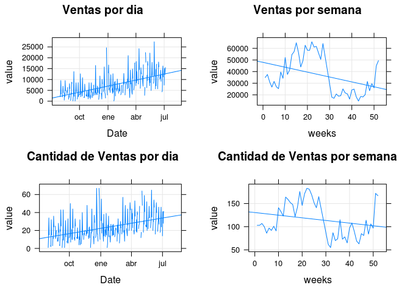

# Index
Facundo Calcagno  
August 24, 2015  

#Ventas por día

```
## Loading required package: DBI
```
##Suma Total de Ventas en el último año##

```
## [1] 1808534
```

#Ventas por día#
 

#Efectividad de Ventas por Marca#

```
##                     brand sales total efectivity
## 1138                 febo   289   297  0.9730640
## 1266                  gap   270   305  0.8852459
## 2745                prune    95   108  0.8796296
## 2799             rapsodia   405   465  0.8709677
## 48                 adidas   254   293  0.8668942
## 3325       tommy hilfiger   174   201  0.8656716
## 2594 paula cahen d anvers   104   121  0.8595041
## 3056            sin marca   184   215  0.8558140
## 2418                 nike   428   504  0.8492063
## 1199           forever 21   503   606  0.8300330
## 31            abercrombie   234   282  0.8297872
## 1602        jazmin chebar   139   168  0.8273810
## 321       banana republic   132   160  0.8250000
## 2120           maria cher   130   158  0.8227848
## 809         cuesta blanca   114   139  0.8201439
## 1491                  hym   167   205  0.8146341
## 3429            undefined    92   113  0.8141593
## 918               divided   140   172  0.8139535
## 88               akiabara   260   322  0.8074534
## 3555             vitamina   106   132  0.8030303
```

#Prendas vendidas y Ventas  por Marca y tipo de prenda #

```
##                  Brand       item price cant price_avg
## 7672              nike zapatillas 27855   79  352.5949
## 1563             levis    campera  6500   20  325.0000
## 1740              zara    campera  4370   14  312.1429
## 7706              vans zapatillas  3370   12  280.8333
## 2476        forever 21       jean  4660   17  274.1176
## 1405            adidas    campera  7615   28  271.9643
## 2521           kosiuko       jean  6060   24  252.5000
## 7604            adidas zapatillas  8490   34  249.7059
## 1187 polo ralph lauren     camisa  3475   14  248.2143
## 2659              zara       jean  3200   13  246.1538
## 7627          converse zapatillas  7735   32  241.7188
## 2410       ay not dead       jean  3380   14  241.4286
## 920           bensimon     camisa  4265   18  236.9444
## 1615          ona saez    campera  2825   12  235.4167
## 1603              nike    campera  8695   37  235.0000
## 1549           kosiuko    campera  2550   11  231.8182
## 1031     garcon garcia     camisa  3210   14  229.2857
## 875        abercrombie     camisa  2500   11  227.2727
## 7333           divided    vestido  2895   13  222.6923
## 2630          trafaluc       jean  2415   11  219.5455
```

  
